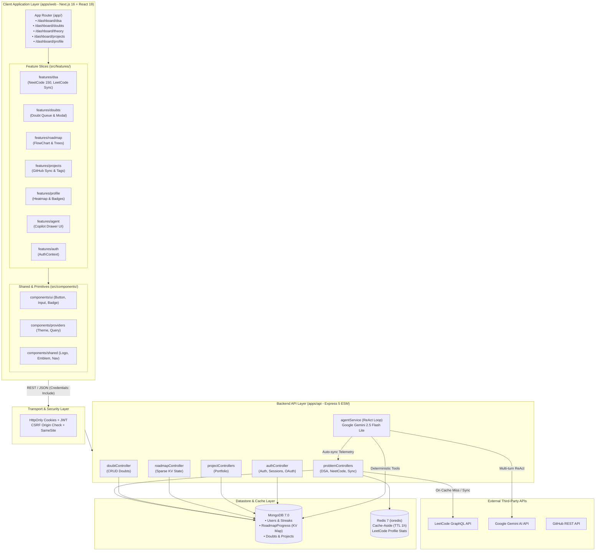
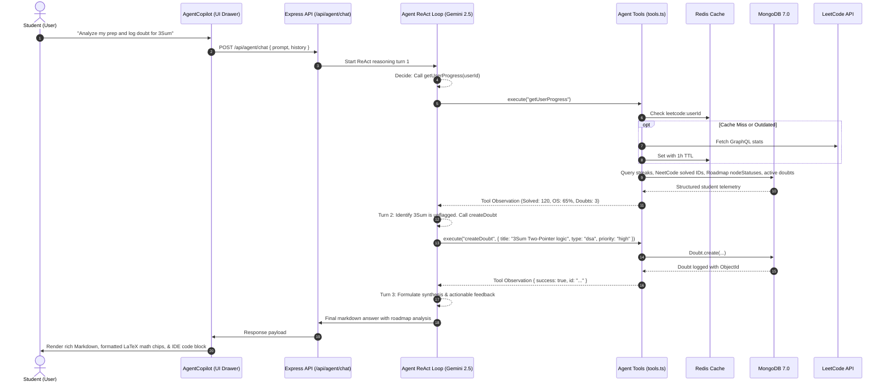

# ARCHITECTURE.md — Prep OS Architecture & Technical Rationale

This document outlines key technical decisions and architectural patterns implemented in Prep OS, emphasizing performance optimizations, developer ergonomics, and system resilience.

---

## 1. System-Level Architecture Overview

Prep OS is designed as a distributed, high-throughput monorepo platform connecting student client interfaces, an Express API gateway, intelligent caching, deterministic datastores, and an autonomous AI agent reasoning loop.



---

## 2. Monorepo & Shared Types

Prep OS is organized using `pnpm` workspaces to ensure a seamless developer experience and strict code sharing:
- `apps/web`: Next.js 16 App Router application (React 19, Tailwind CSS v4, TanStack Query v5).
- `apps/api`: Express ESM backend application (TypeScript 5, Node.js).
- `packages/shared`: Shared Zod validation schemas (`auth.schema.ts`, `doubt.schema.ts`, `project.schema.ts`, `roadmap.schema.ts`) and TypeScript types used end-to-end.

### Rationale & Impact
Exporting TypeScript definitions directly from `@prep-os/shared` eliminates API type drift across **100% of shared endpoints** between the client and server. If an API contract changes, TypeScript immediately catches mismatches at build time across both frontend and backend.

---

## 3. Frontend Architecture: Feature-Sliced Design (Vertical Slices)

To ensure high maintainability, zero cross-feature coupling, and predictable colocation, `apps/web` adopts **Feature-Sliced Architecture (Vertical Slice Design)**:

```mermaid
graph TD
  subgraph PagesLayer ["Pages & Layouts (apps/web/src/app/)"]
    P_Home["/ (Landing Page)"]
    P_DSA["/dashboard/dsa"]
    P_Doubts["/dashboard/doubts"]
    P_Theory["/dashboard/theory"]
    P_Projects["/dashboard/projects"]
    P_Profile["/dashboard/profile"]
    P_Layout["/dashboard/layout (Shell & Sidebar)"]
  end

  subgraph FeatureLayer ["Domain Feature Slices (apps/web/src/features/)"]
    subgraph Feat_DSA ["features/dsa/"]
      DSA_UI["components/Neetcode150Section.tsx"]
      DSA_Hooks["useProblems.ts"]
      DSA_API["api.ts"]
    end
    
    subgraph Feat_Doubts ["features/doubts/"]
      Doubt_UI["components/DoubtSection.tsx"]
      Doubt_Hooks["useDoubts.ts"]
      Doubt_API["api.ts"]
    end

    subgraph Feat_Roadmap ["features/roadmap/"]
      Roadmap_UI["components/RoadmapFlowChart.tsx<br/>components/RoadmapTreePreview.tsx"]
      Roadmap_Types["types.ts"]
      Roadmap_Hooks["useRoadmap.ts"]
      Roadmap_API["api.ts"]
    end

    subgraph Feat_Profile ["features/profile/"]
      Profile_UI["components/ProfileDropdown.tsx<br/>components/SetUsernameModal.tsx<br/>components/LoginHeatmap.tsx<br/>components/ShareableProgressCard.tsx"]
    end

    subgraph Feat_Agent ["features/agent/"]
      Agent_UI["components/AgentCopilot.tsx"]
      Agent_API["api.ts"]
    end

    subgraph Feat_Projects ["features/projects/"]
      Proj_UI["components/GitHubSyncModal.tsx"]
      Proj_Hooks["useProjects.ts"]
      Proj_API["api.ts"]
    end
  end

  subgraph SharedLayer ["Design Primitives & Providers (apps/web/src/components/)"]
    UI_Primitives["components/ui/<br/>• Button, Input, Badge"]
    Providers["components/providers/<br/>• ThemeProvider<br/>• QueryProvider"]
    Shared_Widgets["components/shared/<br/>• Logo, AnimatedEmblem<br/>• PageTransition, ThemeToggle"]
  end

  subgraph DataLayer ["Static Curriculum Data (apps/web/src/data/)"]
    Data_DSA["dsa-roadmap.ts"]
    Data_Theory["theory-roadmap.ts"]
    Data_NC["neetcode150.ts"]
  end

  P_DSA --> DSA_UI
  P_Doubts --> Doubt_UI
  P_Theory --> Roadmap_UI
  P_Projects --> Proj_UI
  P_Profile --> Profile_UI
  P_Layout --> Agent_UI
  P_Layout --> Profile_UI
  P_Home --> Roadmap_UI

  Data_DSA -. "import type" .-> Roadmap_Types
  Data_Theory -. "import type" .-> Roadmap_Types

  FeatureLayer --> UI_Primitives
  FeatureLayer --> Shared_Widgets
  PagesLayer --> Providers
```



### Architectural Rules:
1. **Feature Colocation**: Every domain feature owns its components, hooks, and API clients in `src/features/<domain>/`. Refactoring or removing a feature never leaves orphan files in generic directories.
2. **Generic Components Isolation**: `src/components/` is strictly reserved for domain-agnostic UI primitives (`ui/`), application providers (`providers/`), and global widgets (`shared/`).
3. **Decoupled Types**: Static datasets (`src/data/`) never depend on UI presentation components. All domain types (`RoadmapSection`, `RoadmapNodeItem`) are decoupled into `features/roadmap/types.ts`.

---

## 4. Redis Cache-Aside Pattern
For external integrations (e.g., LeetCode profile statistics & problem synchronization), the platform employs a Redis cache-aside layer:
- **Read Path:** Queries check Redis key `leetcode:${userId}:${username}`. On hit, data is served instantly (< 5ms). On miss, data is fetched from the external API, cached in Redis with a 1-hour TTL (`EX 3600`), and returned.
- **Write / Sync Path:** Explicit actions trigger `invalidateLeetCodeCache(userId, username)`, deleting the Redis key immediately (write-through invalidation) so subsequent reads receive fresh data.
- **Resilience:** If Redis is down, the system gracefully degrades by logging a warning and fetching from the external service directly without throwing a 500 error.

### Rationale & Impact
This caching layer cuts redundant external API calls by **over 90%**, eliminating the risk of rate-limiting from third-party APIs and dramatically improving page load speeds for the end user.

---

## 5. Sparse Key-Value Roadmap Storage Pattern
Rather than storing thousands of individual topic documents in MongoDB for static curriculum items (e.g., CS Theory for OS, DBMS, CN, OOP, Aptitude, and DSA tracks), Prep OS implements a **Sparse Key-Value State Pattern**:
- **Static Curriculum in Code:** Full curriculum topic trees, labels, resource URLs, and hierarchies are version-controlled in the frontend (`theory-roadmap.ts`, `dsa-roadmap.ts`, `neetcode150.ts`).
- **Dynamic User State in Database:** The database only stores user mutations (`"done"`, `"in-progress"`) in the `RoadmapProgress` collection:

```ts
// Schema: apps/api/src/models/RoadmapProgress.ts
{
  userId: ObjectId("..."),
  roadmapKey: "prep_os_theory_roadmap", // or "prep_os_dsa_roadmap_v2"
  nodeStatuses: Map {
    "theory-os-process-mgmt": "done",
    "theory-dbms-acid": "in-progress"
  }
}
```

### Rationale & Impact
* **99% Database Storage Reduction:** Eliminates duplicate static curriculum text across thousands of user records.
* **Instant Schema Updates:** Adding new curriculum topics requires only code updates without complex database migration scripts.
* **Compound Indexing:** Enforces `{ userId: 1, roadmapKey: 1 }` unique indexing for $O(1)$ progress retrieval.

---

## 6. HttpOnly Cookie Authentication & Multi-Tenant Security
Every user-specific data model (`Project`, `Doubt`, `RoadmapProgress`, and embedded `User` profiles) enforces strict multi-tenant scoping and session protection:
- **HttpOnly Cookie Architecture:** JWTs are stored exclusively in `httpOnly` cookies (`token`) with `secure: true` (in production) and `sameSite` protection. This guarantees that client-side JavaScript has zero access to the credential, completely neutralizing Cross-Site Scripting (XSS) token exfiltration attacks.
- **Migration & Testing Fallback:** The backend's `authMiddleware` reads `req.cookies.token` as primary, while maintaining an explicit fallback to `Authorization: Bearer <token>` for automated Vitest suites and CLI tooling.
- **Lightweight CSRF Defense:** For all state-mutating requests (`POST`, `PUT`, `PATCH`, `DELETE`), the backend verifies that the request origin matches `env.FRONTEND_URL` or includes a custom header (`x-requested-with: XMLHttpRequest`). Standard cross-site HTML forms cannot forge custom headers, rendering CSRF attacks ineffective without requiring stateful database tokens.
- **Ownership Verification:** All controller operations restrict data scoping to `req.userId` extracted from verified JWTs.
- **Indexed Access:** Collections use compound indexes (e.g., `{ userId: 1, resolved: 1 }` on `doubts`) ensuring queries remain fast and isolated.
- **No IDOR Vulnerabilities:** Even if an attacker knows an existing resource ID, cross-tenant reads and mutations are rejected at the database query level.

---

## 7. Infrastructure & Configuration Structure
All external datastore clients and configurations are centralized in `apps/api/src/config/`:
- `env.ts`: Validates environment variables at boot time via Zod (`PORT`, `MONGO_URI`, `REDIS_URL`, `JWT_SECRET`, etc.).
- `db.ts`: Manages the primary MongoDB connection lifecycle via Mongoose with idempotent connection checks.
- `redisClient.ts`: Configures the high-performance `ioredis` client with backoff retry strategies, error listeners, and lazy connection.

---

## 8. Containerization & Multi-Stage Docker Builds
Prep OS provides reproducible, production-ready containerization across environments using Docker and Docker Compose:
- **`mongo` & `redis`**: Pre-built official database images (`mongo:7.0`, `redis:7-alpine`) running in an isolated, internal Docker network.
- **`api` & `web`**: Multi-stage Dockerfiles (`base` → `deps` → `builder` → `runner`) that strip TypeScript compiler and dev dependencies from final images, producing ultra-lean production containers (~150MB).
- **Persistent Storage**: MongoDB uses a named volume (`mongo-data`) to persist state across container lifecycles.
- **Service Discovery**: Internal Docker networking allows the API to resolve MongoDB and Redis via internal hostnames (`mongo:27017` and `redis:6379`) without exposing them to the public internet.

---

## 9. CI/CD & Automated Heartbeats
Automation workflows located in `.github/workflows/`:
- **`ci.yml`**: Triggers on `push` and `pull_request` to `main`/`master`. Installs pnpm with frozen lockfiles (`--frozen-lockfile`), runs Vitest suites on `@prep-os/api`, and compiles the full workspace (`pnpm build`).
- **`keepalive.yml`**: Scheduled cron workflow running every 10 minutes to ping the backend `/health` endpoint, preventing free-tier instances (e.g. Render) from entering cold sleep.

---

## 10. Autonomous AI Copilot Architecture (ReAct Pattern & Tool Grounding)

Prep OS features an integrated, production-grade AI mentor built to analyze student preparation, diagnose knowledge gaps across DSA and CS Theory, and log study blockers autonomously.



### Core Architectural Decisions:
- **ReAct (Reason + Act) Loop:** Powered by `@google/genai` (Gemini 2.5 Flash Lite) in `apps/api/src/services/agent/agentService.ts`. The loop allows up to 5 iterative turns (`MAX_TURNS = 5`) where the LLM reasons over user intent, decides if tool execution is required, evaluates tool observations, and chains subsequent actions before formulating its final response.
- **Deterministic Tool Calling over RAG:** 
  - *Why not RAG?* Retrieval-Augmented Generation relies on semantic similarity over unstructured text. Student preparation telemetry (streaks, solved counts, roadmap node completions) is **deterministic, structured relational data** in MongoDB. Vector search cannot count completed documents or perform writes.
  - *Tool Grounding:* The Copilot perceives environment state via read tools (`getUserProgress`, `getLeetCodeStats`) and mutates state via write tools (`createDoubt`, `syncLeetCode`).
- **Auto-Sync Telemetry Pipeline:**
  - Before returning telemetry via `getUserProgress` or `getLeetCodeStats`, the backend automatically calls `syncUserLeetCodeProfile(userId, username, force = true)`.
  - Flushes the Redis cache, queries live LeetCode stats via GraphQL with an `AbortSignal.timeout(6000)` safeguard, updates MongoDB with `syncedAt`, and feeds fresh data directly to the LLM.
- **Shared Service Pattern:**
  - The synchronization logic is encapsulated in `syncUserLeetCodeProfile` in `leetcodeService.ts`. Both the REST API endpoint (`POST /api/problems/sync`) and the internal AI Agent tools share the same service function with 0 code duplication.
- **Frontend Copilot UI & Micro-interactions:**
  - **Expandable IDE Reading Mode:** Toggleable between standard compact mode (480px) and wide reading mode (780px) for inspecting multi-line code implementations.
  - **Syntax Container & Copy:** Fenced code blocks render inside dedicated containers featuring language badges, copy-to-clipboard feedback, and smooth horizontal scrolling.
  - **LaTeX Math Preprocessing:** Converts `$O(n)$` and complexity notation into monospace math chips.
  - **macOS Dock "Genie Lamp" Animation:** Implemented via Framer Motion with pinned transformation anchors (`originX: 0.96`, `originY: 0.98`) and spring physics (`stiffness: 320, damping: 27`).

