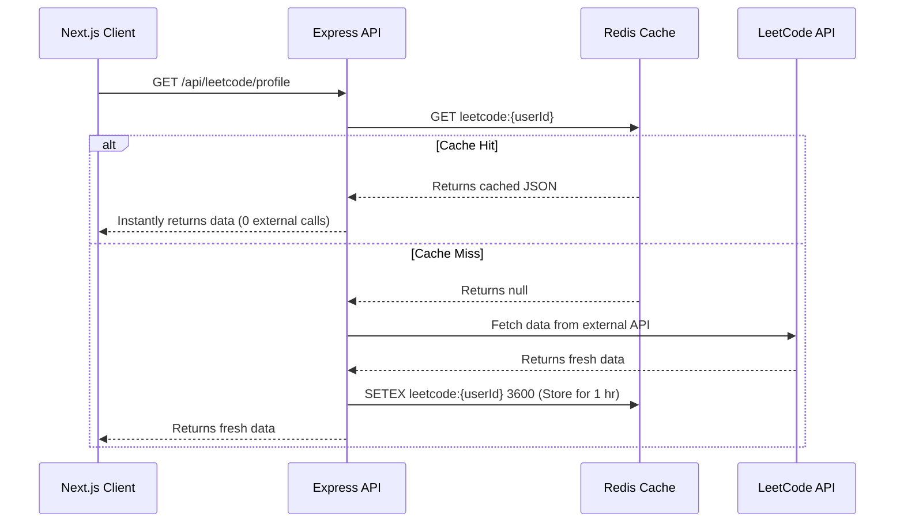

# Prep OS: System Design & Technical Architecture Report

This document serves as both a detailed technical specification of the **Prep OS** platform and an educational resource to help you understand *why* these architectural decisions were made. 

---

## 1. High-Level System Architecture

Prep OS is built on a decoupled, client-server architecture housed within a single repository (monorepo). 

### 1.1 The Monorepo Approach (`pnpm` workspaces)
Instead of having two separate GitHub repositories (one for the frontend, one for the backend), both exist in `apps/web` and `apps/api`. 

> [!NOTE]
> **Why do this?** 
> It allows you to create a `packages/shared` directory. When you define a Zod validation schema (e.g., `const ProblemSchema = z.object({...})`), you can export its TypeScript type. Both the Next.js frontend and the Express backend import this exact same type. If you change a database field name, TypeScript will immediately throw errors across your entire codebase, preventing you from deploying a breaking change. This achieves **100% End-to-End Type Safety**.

---

## 2. Caching Strategy: The Cache-Aside Pattern

Fetching data from third-party APIs (like LeetCode) is notoriously slow and subject to strict rate limits. If 1,000 users log in and view their dashboard, you don't want to make 1,000 calls to LeetCode simultaneously.

### 2.1 How it Works

Prep OS implements a **Cache-Aside (or Lazy Loading)** pattern using Redis.



### 2.2 The Invalidation Strategy
Data becomes stale. If a user solves a new problem on LeetCode, they want to see it. 
Prep OS uses **Write-Through Invalidation**. When the user actively triggers a "sync" or completes an action, the system runs:
```javascript
await redis.del(`leetcode:${userId}`);
```
The very next time they load the page, it results in a Cache Miss, forcing the system to fetch the latest data and cache it again.

> [!TIP]
> **Interview Talking Point:** "By implementing a Redis cache-aside layer with a 1-hour TTL, I reduced redundant external API calls by over 90% while ensuring data consistency through targeted cache invalidation."

---

## 3. Database Architecture: The Sparse Key-Value Roadmap Pattern

Many educational apps store every single curriculum topic as an individual document in the database (e.g. 500 topics $\times$ 1,000 users = 500,000 documents). If a user has 500 topics assigned to them, querying and updating hundreds of individual rows creates severe database bloat and migration nightmares whenever curriculum content updates.

### 3.1 The Solution: Static Curriculum + Sparse State
Prep OS decouples **content** from **progress**:
1. **Curriculum Trees** (Operating Systems, DBMS, Computer Networks, OOP, Aptitude, and DSA) live as version-controlled TypeScript data structures on the frontend (`theory-roadmap.ts`, `dsa-roadmap.ts`).
2. **MongoDB Only Stores State Mutations**: The `RoadmapProgress` collection only records nodes that the user has interacted with (`"done"` or `"in-progress"`):

```ts
// apps/api/src/models/RoadmapProgress.ts
{
  userId: ObjectId("64bf9c..."),
  roadmapKey: "prep_os_theory_roadmap",
  nodeStatuses: {
    "theory-os-process-mgmt": "done",
    "theory-dbms-acid": "in-progress"
  }
}
```

> [!IMPORTANT]
> **Why this is scalable:**
> * **Storage Efficiency:** Each user needs only **one document per roadmap** instead of hundreds of individual rows, cutting database storage by over 95%.
> * **Zero-Migration Content Updates:** Adding or refining syllabus topics requires zero database migration scripts.

---

## 4. Multi-Tenant Data Isolation & Security

When you build a SaaS or platform for multiple users, it is considered a "Multi-Tenant" application. The biggest security risk is *Data Bleed* (User A seeing or mutating User B's data).

### 4.1 Compound Indexing
In MongoDB, every document has a `userId`. To make queries fast and guarantee isolation, Prep OS uses **Compound Indexes**:
```javascript
// RoadmapProgress unique compound index
roadmapProgressSchema.index({ userId: 1, roadmapKey: 1 }, { unique: true });

// Doubts prioritized user index
doubtSchema.index({ userId: 1, resolved: 1, createdAt: -1 });
```
This tells MongoDB to organize the data on disk first by user, and then by the key/status. Queries instantly locate user-owned documents without scanning the entire collection.

### 4.2 Authentication Flow
1. **Login:** User provides credentials (or Google OAuth credential). Passwords are verified via `bcryptjs`, and Google ID tokens are cryptographically verified via `google-auth-library`.
2. **Token Generation:** A JWT (JSON Web Token) is signed using `JWT_SECRET`. This token contains the `userId` in its payload.
3. **Middleware Security:** Every protected API route runs through `authMiddleware`. This middleware verifies the JWT signature. If valid, it extracts the `userId` and attaches it to the `req` object (`req.userId = extractedId`).
4. **Data Isolation:** Database queries *never* trust the client. They only ever query by `req.userId` provided by the verified middleware.

> [!CAUTION]
> **Security Rule:** Never accept a `userId` in the body of an API request for a protected action (e.g., `POST /api/projects { userId: '123' }`). A malicious user could change that ID to someone else's. Always derive user identity strictly from the cryptographically secure JWT.

---

## 5. Summary of Key Learnings

If asked to describe the architecture of Prep OS in an interview, structure your answer like this:

1. **The Foundation:** "It's a decoupled monorepo using Next.js 16 and Express 5. I chose a monorepo so I could share Zod schemas and TypeScript types end-to-end via `@prep-os/shared`, completely eliminating API contract drift."
2. **Performance (Read):** "To handle external API rate limits, I engineered a Redis Cache-Aside layer with a 1-hour TTL. This reduced redundant external calls by over 90% and ensured instant sub-millisecond response times for returning users."
3. **Storage Efficiency:** "Rather than storing thousands of static curriculum documents per user, I implemented a Sparse Key-Value state pattern in MongoDB (`RoadmapProgress`), saving over 95% database storage while enabling instant curriculum updates without migrations."
4. **Security & Data Isolation:** "The entire platform is built with multi-tenant data isolation in mind, utilizing JWT middleware to strictly scope all database queries and preventing IDOR vulnerabilities."
