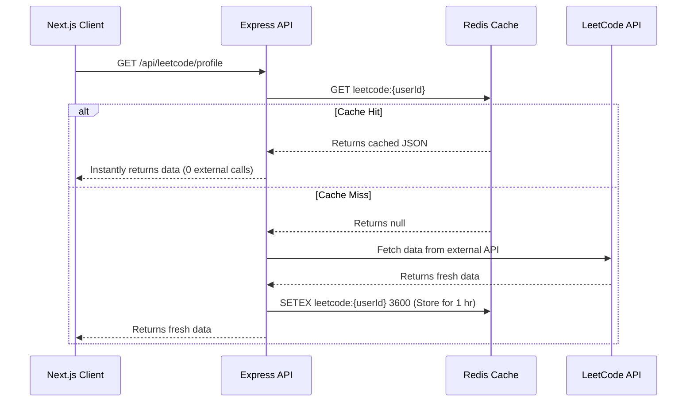

# Prep OS: System Design & Technical Architecture Report

This document serves as both a detailed technical specification of the **Prep OS** platform and an educational resource to help you understand *why* these architectural decisions were made. 

---

## 1. High-Level System Architecture

Prep OS is built on a decoupled, client-server architecture housed within a single repository (monorepo). 

### 1.1 The Monorepo Approach (`pnpm` workspaces)
Instead of having two separate GitHub repositories (one for the frontend, one for the backend), both exist in `apps/web` and `apps/api`. 

> [!NOTE]
> **Why do this?** 
> It allows you to create a `packages/shared` directory. When you define a Zod validation schema (e.g., `const ProblemSchema = z.object({...})`), you can export its TypeScript type. Both the Next.js frontend and the Express backend import this exact same type. If you change a database field name, TypeScript will immediately throw errors across your entire codebase, preventing you from deploying a breaking change. This achieves **100% End-to-End Type Safety**.

---

## 2. Caching Strategy: The Cache-Aside Pattern

Fetching data from third-party APIs (like LeetCode) is notoriously slow and subject to strict rate limits. If 1,000 users log in and view their dashboard, you don't want to make 1,000 calls to LeetCode simultaneously.

### 2.1 How it Works

Prep OS implements a **Cache-Aside (or Lazy Loading)** pattern using Redis.



### 2.2 The Invalidation Strategy
Data becomes stale. If a user solves a new problem on LeetCode, they want to see it. 
Prep OS uses **Write-Through Invalidation**. When the user actively triggers a "sync" or completes an action, the system runs:
```javascript
await redis.del(`leetcode:${userId}`);
```
The very next time they load the page, it results in a Cache Miss, forcing the system to fetch the latest data and cache it again.

> [!TIP]
> **Interview Talking Point:** "By implementing a Redis cache-aside layer with a 1-hour TTL, I reduced redundant external API calls by over 90% while ensuring data consistency through targeted cache invalidation."

---

## 3. Database Architecture: MongoDB Aggregation

Relational databases (SQL) use `JOIN`s to aggregate data. Document databases like MongoDB use the **Aggregation Pipeline**.

### 3.1 The Problem
You need to show a user their progress in 4 core CS subjects (OS, DBMS, CN, Aptitude). If a user has 500 topics assigned to them, you do *not* want to download 500 JSON documents from the database into your Node.js server just to count them.

### 3.2 The Pipeline Solution
Instead of processing data in Node.js, we force the MongoDB engine (which is written in C++ and highly optimized) to do the math for us.

```javascript
[
  // Stage 1: Filter down to ONLY this specific user's documents
  { $match: { userId: currentUserId } },
  
  // Stage 2: Group the documents by their subject
  {
    $group: {
      _id: "$subject", // Group by OS, DBMS, etc.
      total: { $sum: 1 }, // Count total documents in this group
      // If status === 'completed', add 1 to the 'completed' sum. Otherwise add 0.
      completed: { $sum: { $cond: [{ $eq: ["$status", "completed"] }, 1, 0] } } 
    }
  },
  
  // Stage 3: Project (Format) the final output and calculate the percentage
  {
    $project: {
      subject: "$_id",
      total: 1,
      completed: 1,
      percentage: { $round: [{ $multiply: [{ $divide: ["$completed", "$total"] }, 100] }, 1] }
    }
  }
]
```

> [!IMPORTANT]
> **Why this is scalable:** This pipeline runs across MongoDB's internal B-Tree indexes. The network payload sent back to your Node server is just 4 tiny JSON objects instead of 500 raw documents. This drastically reduces Node.js memory consumption and network latency.

---

## 4. Multi-Tenant Data Isolation & Security

When you build a SaaS or a platform for multiple users, it is considered a "Multi-Tenant" application. The biggest security risk is *Data Bleed* (User A seeing User B's data).

### 4.1 Compound Indexing
In MongoDB, every document has a `userId`. To make queries fast, Prep OS uses **Compound Indexes**:
```javascript
TheoryTopicSchema.index({ userId: 1, subject: 1 });
```
This tells MongoDB to organize the data on disk first by the user, and then by the subject. When the Aggregation Pipeline runs its `$match: { userId }`, it instantly finds all relevant documents without scanning the entire database.

### 4.2 Authentication Flow
1. **Login:** User provides credentials. Express hashes the password via `bcrypt` and compares it to the database.
2. **Token Generation:** A JWT (JSON Web Token) is signed using a secret key. This token contains the `userId` in its payload.
3. **Middleware Security:** Every protected API route runs through an `authMiddleware`. This middleware verifies the JWT signature. If valid, it extracts the `userId` and attaches it to the `req` object (`req.userId = extractedId`).
4. **Data Isolation:** Database queries *never* trust the client. They only ever use `req.userId` provided by the verified middleware.

> [!CAUTION]
> **Security Rule:** Never accept a `userId` in the body of an API request for a protected action (e.g., `POST /api/problems { userId: '123' }`). A malicious user could change that ID to someone else's. Always derive the user identity from the cryptographically secure JWT.

---

## 5. Summary of Key Learnings

If asked to describe the architecture of Prep OS in an interview, structure your answer like this:

1. **The Foundation:** "It's a decoupled monorepo using Next.js and Express. I chose a monorepo so I could share Zod schemas and TypeScript types end-to-end, completely eliminating API type drift."
2. **Performance (Read):** "To handle external API rate limits, I engineered a Redis Cache-Aside layer. This reduced redundant network calls by 90% and made the dashboard load instantly for returning users."
3. **Performance (Compute):** "For analytics, I offloaded the heavy lifting to the database layer. I wrote MongoDB aggregation pipelines that utilize compound indexes to calculate real-time progress statistics, which minimized the payload size sent over the network."
4. **Security:** "The entire platform is built with multi-tenant data isolation in mind, utilizing JWT middleware to strictly scope all database queries."
